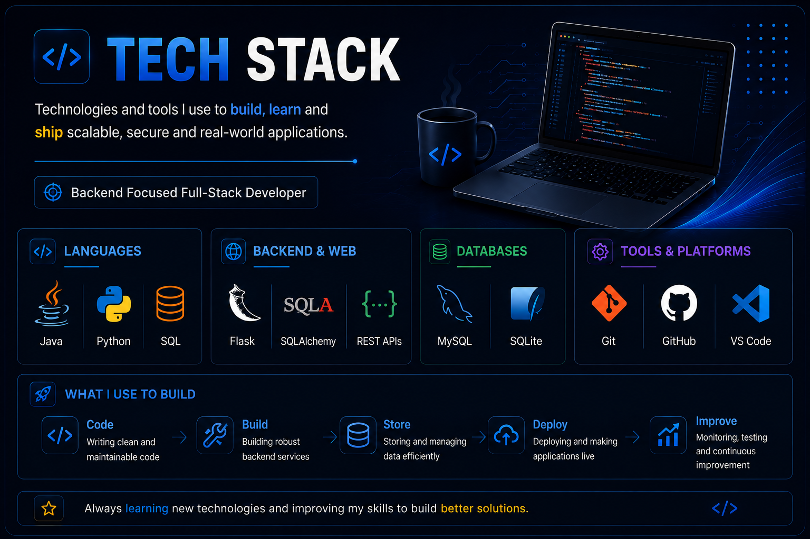

## 👋 About Me

I'm a third-year **B.Tech Information Technology student** focused on backend and full-stack development, problem solving, and building practical software projects.

- 🎓 B.Tech Information Technology Student
- ☕ Strengthening **Java, OOP, Data Structures & Algorithms**
- ⚙️ Building backend applications with **Python, Flask & MySQL**
- 🌐 Exploring **Backend & Full-Stack Development**
- 🧠 Practicing DSA and problem solving for software engineering interviews
- 🚀 Building real-world projects to strengthen development skills

---

## 🛠️ Tech Stack

  

---

## 🚀 Featured Projects

### 🛒 Flipkart Clone

A full-stack e-commerce platform with customer shopping, authentication, cart and order management, admin operations, database integration, Razorpay payment flow, testing, and production deployment.

**Tech:** `Python` `Flask` `MySQL` `SQLAlchemy` `HTML` `CSS` `JavaScript` `Razorpay` `Docker`

🔗 [View Repository](https://github.com/sanketamte96k/Flipkart-clone)

---

### 🎓 College Admission System

A full-stack admission management system designed to simplify student applications, admission workflows, and administrative management.

**Tech:** `Python` `Flask` `MySQL` `HTML` `CSS` `JavaScript`

🔗 [View Repository](https://github.com/sanketamte96k/College-Admission-System)

---

### ☕ Java-Mastery

A Java learning repository covering Core Java, OOP, arrays, problem solving, algorithms, and programming practice.

**Tech:** `Java` `OOP` `DSA`

🔗 [View Repository](https://github.com/sanketamte96k/Java-Mastery)

---

### 🎮 Ignitera Gamified Learning

A gamified learning platform designed to make education more interactive through quizzes, challenges, and game-based learning.

**Tech:** `HTML` `CSS` `JavaScript`

🔗 [View Repository](https://github.com/sanketamte96k/ignitera-gamified-learning)

---

## 🎯 Current Focus

| Area | Goal |
|---|---|
| Java & OOP | Strengthening core Java concepts |
| DSA | Improving problem solving and algorithms |
| SQL & DBMS | Writing efficient queries and understanding databases |
| Backend Development | Building APIs and server-side applications |
| Full-Stack Development | Building complete web applications |
| Interview Preparation | Preparing for software engineering roles |

---

## 💼 Career Goal

To become a strong **Software Developer / Backend Engineer** by mastering Data Structures & Algorithms, building real-world applications, and continuously improving my software engineering skills.

---

## 🤝 Connect With Me

---

**Building. Learning. Improving. One project at a time.**

