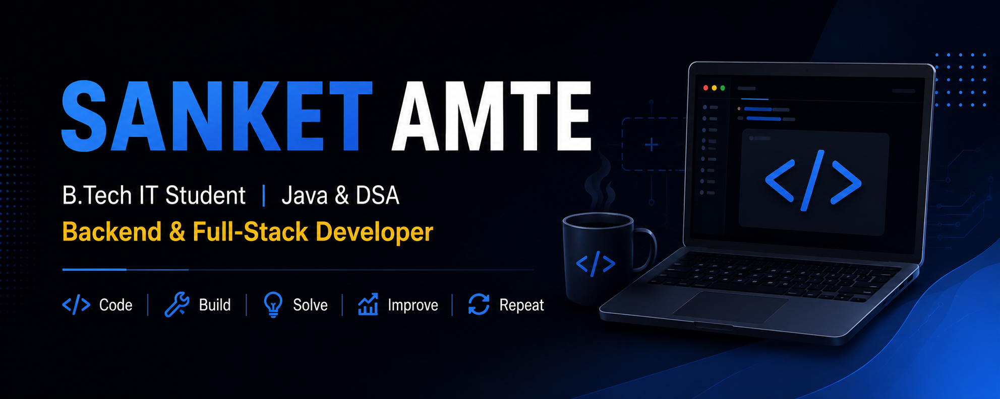

## 👋 About Me

I'm a third-year **B.Tech Information Technology student** focused on building real-world software, strengthening problem-solving skills, and growing as a software developer.

- 🎓 B.Tech Information Technology Student
- ☕ Focused on **Java & Data Structures and Algorithms**
- ⚙️ Building backend applications with **Python, Flask & MySQL**
- 🌐 Exploring **Backend & Full-Stack Development**
- 🧠 Practicing DSA for software engineering interviews
- 🚀 Building projects to strengthen practical development skills

---

## 🛠️ Tech Stack

### 💻 Languages

`Java` `Python` `SQL`

### 🌐 Web & Backend

`HTML` `CSS` `JavaScript` `Flask` `SQLAlchemy` `REST APIs`

### 🗄️ Databases

`MySQL` `SQLite`

### 🔧 Tools & Platforms

`Git` `GitHub` `VS Code`

---

## 📌 Featured Projects

### 🛒 Flipkart Clone

A full-stack e-commerce platform inspired by Flipkart, featuring customer shopping functionality and an admin management system.

**Tech Stack:**  
`Flask` `MySQL` `SQLAlchemy` `HTML` `CSS` `JavaScript`

🔗 [View Repository](https://github.com/sanketamte96k/Flipkart-clone)

---

### 🎓 College Admission System

A full-stack college admission management system designed to simplify student applications and admission workflows.

**Tech Stack:**  
`Flask` `MySQL` `HTML` `CSS` `JavaScript`

🔗 [View Repository](https://github.com/sanketamte96k/College-Admission-System)

---

### ☕ Java-Mastery

My Java learning repository covering Core Java, OOP, arrays, algorithms, problem-solving, and programming practice.

**Tech Stack:**  
`Java` `DSA`

🔗 [View Repository](https://github.com/sanketamte96k/Java-Mastery)

---

### 🎮 Ignitera Gamified Learning

A gamified learning platform designed to make education more interactive through quizzes, challenges, and game-based learning.

**Tech Stack:**  
`HTML` `CSS` `JavaScript`

🔗 [View Repository](https://github.com/sanketamte96k/ignitera-gamified-learning)

---

## 🎯 Current Focus

| Focus Area | Goal |
|---|---|
| ☕ Java & OOP | Strengthening Core Java concepts |
| 🧠 DSA | Improving problem-solving & algorithms |
| 🗄️ SQL & DBMS | Writing efficient queries & understanding databases |
| ⚙️ Backend Development | Building APIs and server-side applications |
| 🌐 Full-Stack Development | Creating complete web applications |
| 💼 Interview Preparation | Preparing for Software Engineering roles |

---

## 💼 Career Goal

To become a strong **Software Developer / Backend Engineer** by mastering Data Structures & Algorithms, building real-world applications, and continuously improving my software engineering skills.

---

## 🤝 Connect With Me

---

### 💡 Building. Learning. Improving. One project at a time.

